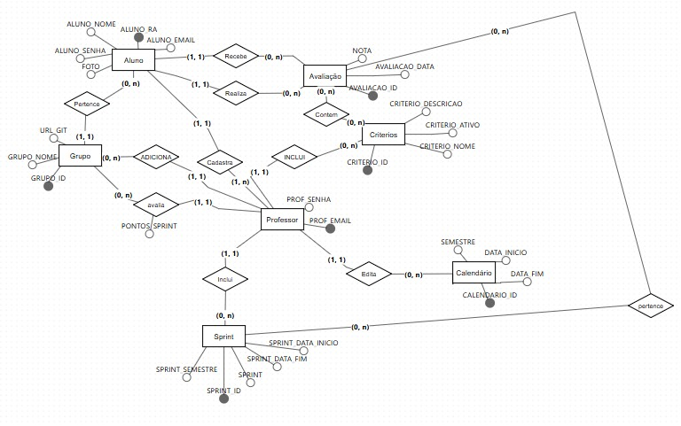

# API-2sem

* [📘 Tema e Descrição do Produto](#tema-e-descrição-do-produto)
* [✅ Requisitos Funcionais](#requisitos-funcionais)
* [✅ Backlog do produto](#backolog-do-produto)
* [✅ Modelagem do banco de dados](#modelagem-do-banco-de-dados)
* [🎯 Missão](#missão)
* [🔭 Visão](#visão)
* [💡 Valores](#valores)
* [👨‍💻 Equipe](#equipe)
* [🛠 Tecnologias](#tecnologias)
* [📜 Requisitos de Permanência do Grupo](#requisitos-de-permanência-do-grupo)
* [📸 Nossa Equipe](#nossa-equipe) <!-- Link adicionado -->

## 📘 Tema e Descrição do Produto

Nosso grupo está desenvolvendo uma solução inovadora para aprimorar o processo de avaliação de competências no PACER, dentro da metodologia de Aprendizagem por Projetos Integrados.

Atualmente, a avaliação é realizada de forma manual, o que gera diversos desafios como:

- *Falta de padronização:* Cada grupo utiliza métodos diferentes para coletar e analisar os dados.
- *Margem para erros:* A possibilidade de erros humanos é alta, tanto na coleta quanto na análise dos dados.
- *Dificuldade em gerar relatórios:* A geração de relatórios personalizados é um processo demorado e complexo.

Nossa proposta é criar um sistema automatizado que irá:

- *Simplificar a avaliação:* Os alunos poderão avaliar seus colegas de forma rápida e intuitiva, diretamente no sistema.
- *Garantir a integridade dos dados:* O sistema irá armazenar todas as avaliações de forma segura e organizada.
- *Gerar relatórios personalizados:* Professores poderão gerar relatórios detalhados sobre o desempenho de cada aluno e grupo.
- *Flexibilizar o processo:* O sistema permitirá a inclusão de novos critérios de avaliação e a adaptação do calendário de Sprints.

Principais Funcionalidades:

- *Avaliação online:* Os alunos poderão realizar as avaliações de forma simples e rápida.
- *Geração de relatórios:* O sistema gerará relatórios personalizados para professores e alunos.
- *Gerenciamento de grupos:* Será possível criar, editar e excluir grupos, além de adicionar e remover membros.
- *Gerenciamento de critérios:* Os critérios de avaliação poderão ser personalizados e gerenciados pelos professores.
- *Calendário de Sprints:* O sistema irá gerenciar o calendário de Sprints, facilitando a associação das avaliações às Sprints corretas.
- *Controle de acesso:* O sistema utilizará autenticação por usuário e senha para garantir a segurança dos dados.

## ✅ Requisitos Funcionais

- Permitir que um aluno avalie todos os membros de sua equipe ao final de cada Sprint;
- Permitir que o professor consiga gerar um relatório contendo a nota média por aluno para cada critério de avaliação em uma determinada Sprint;
- Permitir que o professor consiga gerar um relatório contendo a nota média de todos os alunos de um grupo para uma determinada Sprint;
- Fornecer uma forma de carregar informações referentes aos grupos por meio de arquivo;
- Também deve ser possível incluir ou excluir membros em grupos no caso de realocações;
- Permitir o gerenciamento dos critérios de avaliação. Deve ser possível incluir novos critérios, além de alterar e desativar critérios existentes. Critérios desativados não devem aparecer durante uma avaliação;
- Permitir que o professor cadastre o calendário de Sprints para cada semestre. Em vez de solicitar o número da Sprint em uma avaliação, o sistema deve verificar a data atual e automaticamente assumir que ela está associada à Sprint que acabou de finalizar;
- Usar autenticação por usuário e senha para garantir que cada aluno possa realizar apenas uma avaliação por Sprint e que apenas o professor tenha acesso aos relatórios.
  
## ✅ Backolog do produto

# User Stories

| Rank | Prioridade             | User Story                                                                                                                                                                | Estimativa para Sprint | Perguntas para validação                                                                                   |
|------|------------------------|-------------------------------------------------------------------------------------------------------------------------------------------------------------------------|------------------------|-----------------------------------------------------------------------------------------------------------|
| 1    | Média                  | Como aluno, quero avaliar todos os membros da minha equipe ao final de cada Sprint, para que a contribuição de cada um seja levada em consideração.                      | 3                      | A avaliação deve ser anônima e permitir a nota de todos os membros do grupo. O sistema deve confirmar que todos os membros foram avaliados antes de concluir? |
| 2    | Alta                   | Como professor, quero gerar relatórios contendo a nota média por aluno para cada critério de avaliação de uma Sprint, para acompanhar o desempenho individual em cada aspecto. | 3                      | O relatório deve ser gerado automaticamente ao final de cada Sprint e permitir exportação em PDF e/ou CSV? |
| 3    | Alta                   | Como professor, quero gerar relatórios com a nota média de todos os alunos de um grupo em uma Sprint específica, para poder comparar o desempenho coletivo.             | 3                      | O sistema deve permitir a escolha de diferentes Sprints e grupos, com filtros avançados para análise de desempenho? |
| 4    | Alta                   | Como professor, quero carregar informações de grupos e alunos por meio de arquivos, para facilitar o processo de inserção de dados em lote.                             | 3                      | O sistema deve aceitar arquivos CSV e realizar validação dos dados antes da inserção?                      |
| 5    | Alta                   | Como professor, quero poder incluir ou excluir membros em grupos em caso de realocações, para refletir mudanças no time durante o semestre.                             | 3                      | A realocação deve ser registrada no histórico do sistema e notificar automaticamente os alunos envolvidos? |
| 6    | Alta                   | Como professor, quero gerenciar os critérios de avaliação, incluindo a criação, alteração e desativação de critérios, para adaptar as avaliações às necessidades específicas de cada turma. | 2                      | Critérios desativados não devem aparecer para os alunos durante a avaliação. O histórico de alterações deve ser registrado? |
| 7    | Alta                   | Como professor, quero cadastrar o calendário de Sprints para todo o semestre, para que o sistema associe automaticamente cada Sprint à sua data correta sem a necessidade de inserção manual. | 3                      | O sistema deve verificar a data atual para vincular automaticamente as avaliações às Sprints concluídas?  |
| 8    | Baixa                  | Como usuário (aluno ou professor), quero acessar o sistema por meio de autenticação com login e senha, para garantir a segurança das informações.                        | 1                      | O sistema deve validar a força da senha e permitir a recuperação de senha via e-mail. A autenticação deve ser segura e eficiente. |
| 9    | Baixa                  | Como professor, quero receber notificações automáticas quando um prazo de Sprint estiver próximo do fim, para garantir que todos os alunos concluam suas avaliações a tempo. | 4                      | O sistema poderia enviar notificações via e-mail 3 dias antes do fim da Sprint?                            |
| 10   | Baixa                  | Como aluno, quero visualizar minhas notas médias por critério após cada Sprint, para acompanhar meu progresso e identificar áreas de melhoria.                          | 4                      | O sistema deve gerar um painel visual com gráficos que mostram o desempenho ao longo das Sprints?         |
| 11   | Baixa                  | Como professor, quero ter acesso a um manual do usuário para entender como utilizar todas as funcionalidades do sistema de maneira eficaz.                              | 4                      | O manual deve estar disponível online e incluir uma versão em PDF para download?                          |
| 12   | Média                  | Como professor, desejo importar um arquivo .csv para adicionar informações dos alunos de maneira rápida e automatizada.                                                 | 3                      | O sistema deve aceitar arquivos .csv formatados corretamente e fornecer feedback caso ocorram erros durante a importação? |
| 13   | Sujeito a validação    | Como professor, quero criar semestres no sistema para dividir as turmas e organizar as equipes conforme necessário.                                                      | 3                      | Deve ser possível criar, editar e excluir semestres, além de associar alunos e grupos a eles.             |
| 14   | Sujeito a validação    | Como aluno, preciso atribuir notas aos meus colegas de equipe ao final de cada Sprint, para contribuir com a avaliação de desempenho de cada um.                        | 4                      | O sistema deve garantir que todas as avaliações sejam registradas antes de concluir a Sprint.             |
| 15   | Sujeito a validação    | Como professor, quero definir um limite de pontos a ser distribuído pelos alunos durante as avaliações, permitindo que cada membro seja avaliado de acordo com o desempenho no grupo. | 4                      | Deve haver um controle de pontos máximo para cada avaliação, e o sistema precisa validar a distribuição correta dos pontos pelos alunos. |
| 16   | Média                  | Como usuário (aluno ou professor), preciso acessar o sistema usando meu e-mail e senha, para garantir segurança no acesso e na gestão das informações.                   | 1                      | O sistema deve permitir login com e-mail e senha, além de opções de recuperação de senha?                 |
| 17   | Média                  | Como professor, quero ter a capacidade de criar e editar critérios de avaliação para customizar a forma como o desempenho dos alunos é medido.                          | 3                      | O sistema deve permitir a criação, edição e exclusão de critérios, com a possibilidade de ativar ou desativar conforme necessário? |
| 18   | Média                  | Como professor, quero alterar os membros de um grupo ao longo do semestre, para que as mudanças na composição das equipes sejam refletidas no sistema.                   | 3                      | O sistema deve permitir a alteração de membros de grupos, registrando a data e o motivo da alteração?     |
| 19   | Média                  | Como professor, quero criar Sprints no sistema, para que os alunos possam avaliar seus colegas de equipe periodicamente.                                                 | 3                      | O sistema deve permitir a criação de Sprints com datas definidas, vinculando automaticamente as avaliações a cada Sprint? |
| 20   | Alta                   | Como professor, desejo cadastrar o calendário das Sprints, para que o sistema possa automaticamente associar as avaliações às Sprints corretas com base nas datas.       | 3                      | O calendário deve ser configurado no início do semestre, e as Sprints devem ser automaticamente vinculadas às datas de avaliação? |
| 21   | Alta                   | Como professor, preciso gerar relatórios com a nota média de todos os alunos de um grupo, para visualizar o desempenho coletivo.                                         | 3                      | O sistema deve permitir gerar relatórios filtrados por grupo e Sprint, com opção de exportação em PDF e CSV? |
| 22   | Alta                   | Como professor, quero gerar relatórios detalhados com a nota média por aluno para cada critério de avaliação, a fim de analisar o desempenho individual.                 | 3                      | O sistema deve permitir filtrar os relatórios por aluno e por critério, com gráficos visuais do progresso ao longo do tempo? |
| 23   | Baixa                  | Como aluno, quero visualizar a nota média de todos os integrantes do meu grupo, para ter uma visão geral do desempenho da equipe.                                        | 4                      | O sistema deve exibir as notas médias em um painel visual, com gráficos e comparações entre os membros?   |
| 24   | Baixa                  | Como aluno, quero acompanhar minhas notas médias por critério de avaliação, para entender onde posso melhorar nas próximas Sprints.                                     | 4                      | O sistema deve exibir um painel detalhado de desempenho individual, com gráficos e comparativos por critério? |
| 25   | Baixa                  | Como professor, quero poder redefinir minha senha via e-mail, para recuperar o acesso ao sistema caso eu a esqueça.                                                     | 4                      | O sistema deve enviar um link de redefinição de senha ao e-mail cadastrado e validar o novo acesso?       |
| 26   | Baixa                  | Como aluno, também quero poder redefinir minha senha por e-mail, caso eu esqueça ou perca o acesso.                                                                     | 4                      | O sistema deve enviar um e-mail com instruções para redefinição de senha, garantindo a segurança do processo? |

[Clique aqui visualizar o backlog do produto](docs/backlog.pdf)

Devido a quantidade de informações, será necessário baixar o arquivo para visualizar, clique no link a seguir [DoR,_UserStory_e_DoD](docs/userstory.xlsx)

[Clique aqui para visualizar as validações feitas com o cliente](docs/Validacoes.pdf)

[Clique aqui visualizar a sprint backlog com o que está previsto para a sprint 4](docs/sprintbacklog.pdf)

## ✅ Modelagem do banco de dados

## Contribuições

## 🎯 Missão

Facilitar o acesso e a compreensão dos princípios da programação e lógica de algoritmos, capacitando indivíduos a desenvolverem habilidades essenciais para a resolução de problemas computacionais e contribuindo para a inovação e desenvolvimento tecnológico.

## 🔭 Visão

Nossa visão é nos tornarmos referência na área de desenvolvimento de sistemas, integrando de forma eficiente as funções dos colaboradores e compreendendo a importância da colaboração entre as diferentes áreas.

## 💡 Valores

Valorizamos a dedicação, o comprometimento com o desenvolvimento organizacional, a ética, a integridade e a transparência em todas as nossas ações.

 

## 👨‍💻 Equipe

#### *Integrantes:* 
- Rafael Slivka (Scrum Master)
- Larissa Claro (Product Owner)
- Thiago Abreu (Scrum Team)
- Mariana Yasmin (Scrum Team)
- Tiago Bernardo (Scrum Team)
- Beatriz Santos (Scrum Team)
- Luiz Ricardo (Scrum Team)

 

## 🛠 Tecnologias

#### Foram utilizadas as seguintes tecnologias:

  
  
  
  
  
  
  
  

## 📜 Requisitos de Permanência do Grupo

- Será aceito apenas 1 falta por mês nas reuniões semanais (quarta-feira).
- Respeitar os prazos e padrões de commit (organização).
- Expor dificuldades durante o processo, evitando problemas próximos à apresentação.
- Propõe-se que todos apresentem pelo menos uma sprint.

## 📸 Nossa Equipe

| *Rafael Slivka* (Scrum Master) | *Larissa Claro* (Product Owner) | *Thiago Abreu* (Scrum Team) | *Mariana Yasmin* (Scrum Team) |
|:-------------------------------:|:---------------------------------:|:----------------------------:|:------------------------------:|
|  |  |  |  |
|  |  |  |  |

| *Tiago Bernardo* (Scrum Team) | *Beatriz Sthefanny* (Scrum Team) | *Luiz Silva* (Scrum Team) |
|:-------------------------------:|:-------------------------------:|:----------------------------:|
|  |  |  |
|  |  |  |
