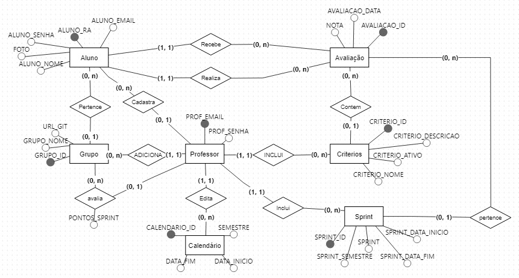

# API-2sem

* [📘 Tema e Descrição do Produto](#tema-e-descrição-do-produto)
* [✅ Requisitos Funcionais](#requisitos-funcionais)
* [✅ Documentação](#Documentação)
* [✅ Modelagem do banco de dados](#modelagem-do-banco-de-dados)
* [🎯 Missão](#missão)
* [🔭 Visão](#visão)
* [💡 Valores](#valores)
* [👨‍💻 Equipe](#equipe)
* [🛠 Tecnologias](#tecnologias)
* [📜 Requisitos de Permanência do Grupo](#requisitos-de-permanência-do-grupo)
* [📸 Nossa Equipe](#nossa-equipe) <!-- Link adicionado -->

## 📘 Tema e Descrição do Produto

Nosso grupo está desenvolvendo uma solução inovadora para aprimorar o processo de avaliação de competências no PACER, dentro da metodologia de Aprendizagem por Projetos Integrados.

Atualmente, a avaliação é realizada de forma manual, o que gera diversos desafios como:

- *Falta de padronização:* Cada grupo utiliza métodos diferentes para coletar e analisar os dados.
- *Margem para erros:* A possibilidade de erros humanos é alta, tanto na coleta quanto na análise dos dados.
- *Dificuldade em gerar relatórios:* A geração de relatórios personalizados é um processo demorado e complexo.

Nossa proposta é criar um sistema automatizado que irá:

- *Simplificar a avaliação:* Os alunos poderão avaliar seus colegas de forma rápida e intuitiva, diretamente no sistema.
- *Garantir a integridade dos dados:* O sistema irá armazenar todas as avaliações de forma segura e organizada.
- *Gerar relatórios personalizados:* Professores poderão gerar relatórios detalhados sobre o desempenho de cada aluno e grupo.
- *Flexibilizar o processo:* O sistema permitirá a inclusão de novos critérios de avaliação e a adaptação do calendário de Sprints.

Principais Funcionalidades:

- *Avaliação online:* Os alunos poderão realizar as avaliações de forma simples e rápida.
- *Geração de relatórios:* O sistema gerará relatórios personalizados para professores e alunos.
- *Gerenciamento de grupos:* Será possível criar, editar e excluir grupos, além de adicionar e remover membros.
- *Gerenciamento de critérios:* Os critérios de avaliação poderão ser personalizados e gerenciados pelos professores.
- *Calendário de Sprints:* O sistema irá gerenciar o calendário de Sprints, facilitando a associação das avaliações às Sprints corretas.
- *Controle de acesso:* O sistema utilizará autenticação por usuário e senha para garantir a segurança dos dados.

## ✅ Requisitos Funcionais

- Permitir que um aluno avalie todos os membros de sua equipe ao final de cada Sprint;
- Permitir que o professor consiga gerar um relatório contendo a nota média por aluno para cada critério de avaliação em uma determinada Sprint;
- Permitir que o professor consiga gerar um relatório contendo a nota média de todos os alunos de um grupo para uma determinada Sprint;
- Fornecer uma forma de carregar informações referentes aos grupos por meio de arquivo;
- Também deve ser possível incluir ou excluir membros em grupos no caso de realocações;
- Permitir o gerenciamento dos critérios de avaliação. Deve ser possível incluir novos critérios, além de alterar e desativar critérios existentes. Critérios desativados não devem aparecer durante uma avaliação;
- Permitir que o professor cadastre o calendário de Sprints para cada semestre. Em vez de solicitar o número da Sprint em uma avaliação, o sistema deve verificar a data atual e automaticamente assumir que ela está associada à Sprint que acabou de finalizar;
- Usar autenticação por usuário e senha para garantir que cada aluno possa realizar apenas uma avaliação por Sprint e que apenas o professor tenha acesso aos relatórios.

## ✅ Documentação

Backlog do produto

### Backlog do Produto

| Rank | Prioridade             | User Story                                                                                                                                                                | Estimativa para Sprint | Perguntas para validação                                                                                   |
|------|------------------------|-------------------------------------------------------------------------------------------------------------------------------------------------------------------------|------------------------|-----------------------------------------------------------------------------------------------------------|
| 1    | Média                  | Como aluno, quero avaliar todos os membros da minha equipe ao final de cada Sprint, para que a contribuição de cada um seja levada em consideração.                      | 3                      | A avaliação deve ser anônima e permitir a nota de todos os membros do grupo. O sistema deve confirmar que todos os membros foram avaliados antes de concluir? |
| 2    | Alta                   | Como professor, quero gerar relatórios contendo a nota média por aluno para cada critério de avaliação de uma Sprint, para acompanhar o desempenho individual em cada aspecto. | 3                      | O relatório deve ser gerado automaticamente ao final de cada Sprint e permitir exportação em PDF e/ou CSV? |
| 3    | Alta                   | Como professor, quero gerar relatórios com a nota média de todos os alunos de um grupo em uma Sprint específica, para poder comparar o desempenho coletivo.             | 3                      | O sistema deve permitir a escolha de diferentes Sprints e grupos, com filtros avançados para análise de desempenho? |
| 4    | Alta                   | Como professor, quero carregar informações de grupos e alunos por meio de arquivos, para facilitar o processo de inserção de dados em lote.                             | 3                      | O sistema deve aceitar arquivos CSV e realizar validação dos dados antes da inserção?                      |
| 5    | Alta                   | Como professor, quero poder incluir ou excluir membros em grupos em caso de realocações, para refletir mudanças no time durante o semestre.                             | 3                      | A realocação deve ser registrada no histórico do sistema e notificar automaticamente os alunos envolvidos? |
| 6    | Alta                   | Como professor, quero gerenciar os critérios de avaliação, incluindo a criação, alteração e desativação de critérios, para adaptar as avaliações às necessidades específicas de cada turma. | 2                      | Critérios desativados não devem aparecer para os alunos durante a avaliação. O histórico de alterações deve ser registrado? |
| 7    | Alta                   | Como professor, quero cadastrar o calendário de Sprints para todo o semestre, para que o sistema associe automaticamente cada Sprint à sua data correta sem a necessidade de inserção manual. | 3                      | O sistema deve verificar a data atual para vincular automaticamente as avaliações às Sprints concluídas?  |
| 8    | Baixa                  | Como usuário (aluno ou professor), quero acessar o sistema por meio de autenticação com login e senha, para garantir a segurança das informações.                        | 1                      | O sistema deve validar a força da senha e permitir a recuperação de senha via e-mail. A autenticação deve ser segura e eficiente. |
| 9    | Baixa                  | Como professor, quero receber notificações automáticas quando um prazo de Sprint estiver próximo do fim, para garantir que todos os alunos concluam suas avaliações a tempo. | 4                      | O sistema poderia enviar notificações via e-mail 3 dias antes do fim da Sprint?                            |
| 10   | Baixa                  | Como aluno, quero visualizar minhas notas médias por critério após cada Sprint, para acompanhar meu progresso e identificar áreas de melhoria.                          | 4                      | O sistema deve gerar um painel visual com gráficos que mostram o desempenho ao longo das Sprints?         |
| 11   | Baixa                  | Como professor, quero ter acesso a um manual do usuário para entender como utilizar todas as funcionalidades do sistema de maneira eficaz.                              | 4                      | O manual deve estar disponível online e incluir uma versão em PDF para download?                          |
| 12   | Média                  | Como professor, desejo importar um arquivo .csv para adicionar informações dos alunos de maneira rápida e automatizada.                                                 | 3                      | O sistema deve aceitar arquivos .csv formatados corretamente e fornecer feedback caso ocorram erros durante a importação? |
| 13   | Média    | Como professor, quero criar semestres no sistema para dividir as turmas e organizar as equipes conforme necessário.                                                      | 3                      | Deve ser possível criar, editar e excluir semestres, além de associar alunos e grupos a eles.             |
| 14   | Alta    | Como aluno, preciso atribuir notas aos meus colegas de equipe ao final de cada Sprint, para contribuir com a avaliação de desempenho de cada um.                        | 4                      | O sistema deve garantir que todas as avaliações sejam registradas antes de concluir a Sprint.             |
| 15   | Alta    | Como professor, quero definir um limite de pontos a ser distribuído pelos alunos durante as avaliações, permitindo que cada membro seja avaliado de acordo com o desempenho no grupo. | 4                      | Deve haver um controle de pontos máximo para cada avaliação, e o sistema precisa validar a distribuição correta dos pontos pelos alunos. |

Sprint

## ✅ Validações com o cliente ao longo das sprints

| **Data**       | **Mensagem Enviada**                                                                                                                                                                                                                                                                                                                                                                                                                                                                                                                                                                                                     | **Retorno**                                                                                                                                                                     |
|-----------------|-------------------------------------------------------------------------------------------------------------------------------------------------------------------------------------------------------------------------------------------------------------------------------------------------------------------------------------------------------------------------------------------------------------------------------------------------------------------------------------------------------------------------------------------------------------------------------------------------------------------------|--------------------------------------------------------------------------------------------------------------------------------------------------------------------------------|
| 04/09/2024      | Para essa primeira sprint, entendemos como importante a entrega de documentação do projeto, para que tenha entendimento de como será o desenvolvimento. Junto a isso, também pretendemos entregar o escopo da interface, sem os códigos, mas para nortear como deverá ficar. O senhor está de acordo, tem algo a acrescentar?                                                                                                                                                                                                                          | "Olá Larissa. Podem seguir com esse planejamento."                                                                                                                             |
| 17/09/2024      | A equipe está montando o protótipo da primeira tela, onde quem for acessar (aluno ou professor) deverá inserir o login e a senha de acesso. Nessa tela, também ficará visível o nome do software. Gostaríamos da sua validação em alguns pontos: 1- Temos como sugestão o nome "Pecer+", a intenção é remeter o nome do método de avaliação deixando aberta a possibilidade de inclusão de outros atributos. O que acha?                                                                                                                            | 1- Não seria PACER+?                                                                                                                                                           |
| 17/09/2024      | 2- Para o login, prefere e-mail ou CPF?                                                                                                                                                                                                                                                                                                                                                                                                                                                                                                                                          | 2- E-mail da Fatec                                                                                                                                                             |
| 17/09/2024      | 3- O formato de senha, pensamos em solicitar no mínimo 8 dígitos, com letras e números. Tudo bem?                                                                                                                                                                                                                                                                                                                                                                                                                                                                                | 3- Tudo bem                                                                                                                                                                    |
| 26/09/2024      | Estamos nos organizando para nosso encontro da próxima semana. Em relação à documentação, queremos demonstrar como iremos seguir com a elaboração do manual de usuário, que será desenvolvido ao decorrer do projeto. Apesar de manuais costumarem ter um padrão, gostaríamos que visualizasse como está, para então podermos personalizar de acordo com suas necessidades. Tudo bem?                                                                                                                                                             | 1 - Tudo bem, mas foquem em deixá-lo didático. A aparência não é muito importante.                                                                                            |
| 26/09/2024      | 2 - Para os protótipos, elaboramos o visual da tela de login e outro da tela inicial do aluno, onde ele poderá acessar os critérios de avaliação, realizar a avaliação e ver o calendário. Por favor, está de acordo com essas entregas iniciais ou possui algo a acrescentar?                                                                                                                                                                                                                                                               | 2 - Somente com a descrição fica difícil imaginar como essas telas funcionam.                                                                                                 |
| 06/10/2024      | Feedback da Sprint: Você precisa se comunicar mais. É preciso detalhar as User Stories a desenvolver antes da sprint começar (precisa ter o que foi conversado com a empresa, protótipo de tela, etc).                                                                                                                                                                                                                                                                                                                                                                          | -                                                                                                                                                                              |
| 08/10/2024      | 1 - Para login, o sistema pode reconhecer se é adm ou aluno que está acessando e então abrir uma tela inicial de acordo com o usuário ou prefere que sejam telas de login separadas (uma para o professor administrador e outra para o aluno)?                                                                                                                                                                                                                                                                                                                                | 1 - Seria bom funcionar assim, mas o login é menos prioritário que dar notas e gerar relatórios.                                                                              |
| 08/10/2024      | 2 - Para a redefinição de senha, prefere um botão "esqueci minha senha" que já libere na própria tela a redefinição ou um botão "esqueci minha senha" que envie por e-mail uma senha temporária?                                                                                                                                                                                                                                                                                                                                                                                 | 2 - Pode ser feita pelo professor ou e-mail, mas é algo de baixíssima prioridade.                                                                                             |
| 08/10/2024      | 3 - Temos como sugestão que o professor receba por e-mail um lembrete para atribuir pontuação a cada sprint, essa notificação deverá ser enviada um dia após a data marcada para o dia de apresentação no calendário. O que acha?                                                                                                                                                                                                                                                                                                                                              | 3 - Seria bom, mas também é algo de baixa prioridade.                                                                                                                         |
| 17/10/2024      | A avaliação deve ser anônima e permitir a nota de todos os membros do grupo. O sistema deve exibir aos membros do grupo se todos já realizaram a avaliação ou se ainda está pendente?                                                                                                                                                                                                                                                                                                                                                                                           | Isso é interessante, mas não prioritário.                                                                                                                                    |
| 17/10/2024      | O sistema irá disponibilizar relatórios. Quanto ao formato do arquivo, prefere Excel (CSV) ou PDF?                                                                                                                                                                                                                                                                                                                                                                                                                                                                              | CSV                                                                                                                                                                           |
| 17/10/2024      | Campo de relatórios: prefere que seja por turma ou disponibilizamos filtros para isso ser definido de acordo com a necessidade da ocasião?                                                                                                                                                                                                                                                                                                                                                                                                                                       | Filtros                                                                                                                                                                       |
| 17/10/2024      | É importante manter um histórico das movimentações realizadas (ex.: administrador incluiu o aluno Silva no grupo às 12h de 17/10/2024)?                                                                                                                                                                                                                                                                                                                                                                                                                                         | Não precisa                                                                                                                                                                   |
| 12/11/2024      | Anteriormente falamos sobre o login do aluno ser com o e-mail. O professor administrador deverá ser da mesma forma ou deverá ser um usuário padrão "admin" e uma senha também padrão que ele poderá atualizar?                                                                                                                                                                                                                                                                                                                                                                 | Pode propor algo                                                                                                                                                              |
| 12/11/2024      | É importante que na tela de avaliações o aluno avaliador consiga visualizar, após ter avaliado, qual pontuação atribuiu para cada colega?                                                                                                                                                                                                                                                                                                                                                                                                                                       | Sim, é importante que ele veja. Não precisa mostrar o e-mail nessa tela.                                                                                                     |
| 12/11/2024      | Outro ponto que gostaríamos de entender é se deverá ficar disponível para os alunos cada nota, de cada critério e a cada sprint ou somente o acumulado.                                                                                                                                                                                                                                                                                                                                                                                                                         | Basta a média                                                                                                                                                                 |

## ✅ Epics de todo projeto

| **Atividade**                 | **Epic**                                                                                                                                                          | **Critério de Aceitação**                                                                                                                                                  |
|--------------------------------|------------------------------------------------------------------------------------------------------------------------------------------------------------------|--------------------------------------------------------------------------------------------------------------------------------------------------------------------------|
| Avaliação de Membros da Equipe | "Como aluno, Eu quero avaliar todos os membros da minha equipe ao final de cada Sprint, Para que o desempenho deles seja registrado e considerado na avaliação final." | "O sistema deve permitir que cada aluno avalie todos os membros da equipe ao final de uma Sprint. O aluno deve poder fazer uma única avaliação por Sprint."              |
| Relatório de Notas Individuais | "Como professor, Eu quero gerar um relatório contendo a nota média de cada aluno por critério de avaliação em uma determinada Sprint, Para que eu possa analisar o desempenho individual dos alunos." | O sistema deve gerar um relatório com a nota média por aluno em cada critério para uma Sprint específica.                                                                |
| Relatório de Notas do Grupo    | "Como professor, Eu quero gerar um relatório contendo a nota média de todos os alunos de um grupo para uma Sprint específica, Para que eu possa verificar o desempenho coletivo do grupo." | O sistema deve gerar um relatório com a média de todos os alunos de um grupo para uma Sprint.                                                                             |
| Gerenciamento de Grupos        | "Como professor, Eu quero carregar informações de grupos por meio de um arquivo, Para que eu possa gerenciar os grupos de alunos de forma mais eficiente."         | O sistema deve permitir a importação de grupos por arquivo e a inclusão/exclusão de membros de grupos.                                                                   |
| Gerenciamento de Critérios de Avaliação | "Como professor, Eu quero gerenciar os critérios de avaliação, Para que eu possa adicionar novos critérios, alterar ou desativar os existentes conforme necessário." | "O sistema deve permitir a inclusão, alteração e desativação de critérios de avaliação. Critérios desativados não devem aparecer nas avaliações realizadas pelos alunos." |
| Calendário de Sprints          | "Como professor, Eu quero cadastrar o calendário de Sprints para cada semestre, Para que o sistema identifique automaticamente a Sprint em que uma avaliação está sendo realizada." | O sistema deve verificar a data atual e associar automaticamente a avaliação à Sprint correspondente.                                                                    |
| Autenticação                   | "Como aluno, Eu quero realizar login com usuário e senha, Para que eu possa garantir que apenas eu faça minha avaliação e que meus dados sejam protegidos."        | "O sistema deve exigir autenticação de usuário e senha para alunos realizarem a avaliação. Somente o professor deve ter acesso aos relatórios."       

## ✅ Backlog Sprint 4
                   
| Prioridade | User Story | Descrição Detalhada |
|---|---|---|
| Média | Como aluno, quero visualizar minhas notas médias por critério após cada Sprint, para acompanhar meu progresso e identificar áreas de melhoria. | O sistema deve gerar gráficos ou relatórios que demonstrem a evolução das notas do aluno ao longo das Sprints, permitindo a identificação de pontos fortes e fracos em cada critério de avaliação. |
| Média | Como professor, eu quero definir um limite de pontos a ser distribuído pelos alunos durante as avaliações, permitindo que cada membro seja avaliado de acordo com o desempenho no grupo. | O sistema deve oferecer um mecanismo para que o professor configure a pontuação máxima de cada avaliação e distribua essa pontuação entre os diferentes critérios. Além disso, deve calcular a nota individual de cada aluno com base no desempenho em cada critério e na ponderação definida pelo professor. |
| Média | Como aluno, eu quero visualizar a nota média de todos os integrantes do meu grupo, para ter uma visão geral do desempenho da equipe. | O sistema deve apresentar um painel com a média das notas de todos os membros do grupo, permitindo que os alunos acompanhem o desempenho geral da equipe e identifiquem possíveis áreas de colaboração. |
| Média | Como aluno, eu quero acompanhar minhas notas médias por critério de avaliação, para entender onde posso melhorar nas próximas Sprints. | Similar à primeira user story, mas com um foco maior na comparação entre os diferentes critérios de avaliação. O sistema pode gerar um ranking dos critérios, indicando quais exigem maior atenção do aluno. |
| Baixa | Como professor, eu quero poder redefinir minha senha via email, para recuperar o acesso ao sistema caso eu a esqueça. | O sistema deve implementar uma funcionalidade de recuperação de senha que permita ao professor solicitar uma nova senha através do seu endereço de e-mail. |
| Baixa | Como aluno, eu também quero poder redefinir minha senha por e-mail, caso eu esqueça ou perca o acesso. | Similar à user story anterior, mas direcionada para os alunos. |

## Definition of done:

- Código funcional e organizado, disponibilizado no Github (executável);
- Guia de instalação e manual do usuário disponilizado;
- Todas as funcionalidades integradas.

## Definition of ready:

- Revisão do banco de dados junto ao modelo;
- Remoção de dados excedentes contidos no banco;
- O sistema permite solicitar a alteração de senha;
- É possível ver a nota média;

## ✅ Manual do usuário e guia de instalação 

[Clique para acessar o guia de instalação do produto](caminho/para/o/Guia_de_Instalação_e_Execução_do_Executável_PACER-1_(2).pdf)

[Clique para acessar o manual do usuário](caminho/para/o/Manual_de_usuário_PACER+.pdf)

## ✅ Modelagem do banco de dados

## Contribuições

## 🎯 Missão

Facilitar o acesso e a compreensão dos princípios da programação e lógica de algoritmos, capacitando indivíduos a desenvolverem habilidades essenciais para a resolução de problemas computacionais e contribuindo para a inovação e desenvolvimento tecnológico.

## 🔭 Visão

Nossa visão é nos tornarmos referência na área de desenvolvimento de sistemas, integrando de forma eficiente as funções dos colaboradores e compreendendo a importância da colaboração entre as diferentes áreas.

## 💡 Valores

Valorizamos a dedicação, o comprometimento com o desenvolvimento organizacional, a ética, a integridade e a transparência em todas as nossas ações.

 

## 👨‍💻 Equipe

#### *Integrantes:* 
- Rafael Slivka (Scrum Master)
- Larissa Claro (Product Owner)
- Thiago Abreu (Scrum Team)
- Mariana Yasmin (Scrum Team)
- Tiago Bernardo (Scrum Team)
- Beatriz Santos (Scrum Team)
- Luiz Ricardo (Scrum Team)

 

## 🛠 Tecnologias

#### Foram utilizadas as seguintes tecnologias:

  
  
  
  
  
  
  
  

## 📜 Requisitos de Permanência do Grupo

- Será aceito apenas 1 falta por mês nas reuniões semanais (quarta-feira).
- Respeitar os prazos e padrões de commit (organização).
- Expor dificuldades durante o processo, evitando problemas próximos à apresentação.
- Propõe-se que todos apresentem pelo menos uma sprint.

## 📸 Nossa Equipe

| *Rafael Slivka* (Scrum Master) | *Larissa Claro* (Product Owner) | *Thiago Abreu* (Scrum Team) | *Mariana Yasmin* (Scrum Team) |
|:-------------------------------:|:---------------------------------:|:----------------------------:|:------------------------------:|
|  |  |  |  |
|  |  |  |  |

| *Tiago Bernardo* (Scrum Team) | *Beatriz Sthefanny* (Scrum Team) | *Luiz Silva* (Scrum Team) |
|:-------------------------------:|:-------------------------------:|:----------------------------:|
|  |  |  |
|  |  |  |
